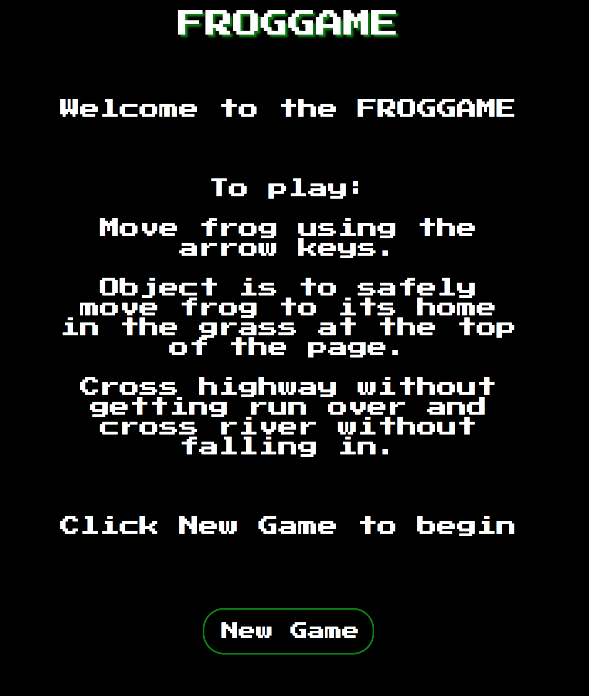

# Frogger

## Synopsis

Frogger is a recreation of the classic video game. The goal for the project was to learn object-oriented programming by creating a game that is playable in the browser. Additionally, this was my first real challenging using ES6, HTML5 Canvas, and test-driven development.

### *Tools/Technologies:* 
* HTML5 Canvas
* ES6
* Mocha/Chai

### *Example:* 

##### Start Screen

##### Main Screen

---

## Contributors

[Eric Jungbluth](https://github.com/EricMellow) & Daniela Carey

_(**Turing School of Software & Design Front-end Engineering project - Mod 2:** first real interactions with OOP, HTML5 Canvas, ES6, and TDD._
